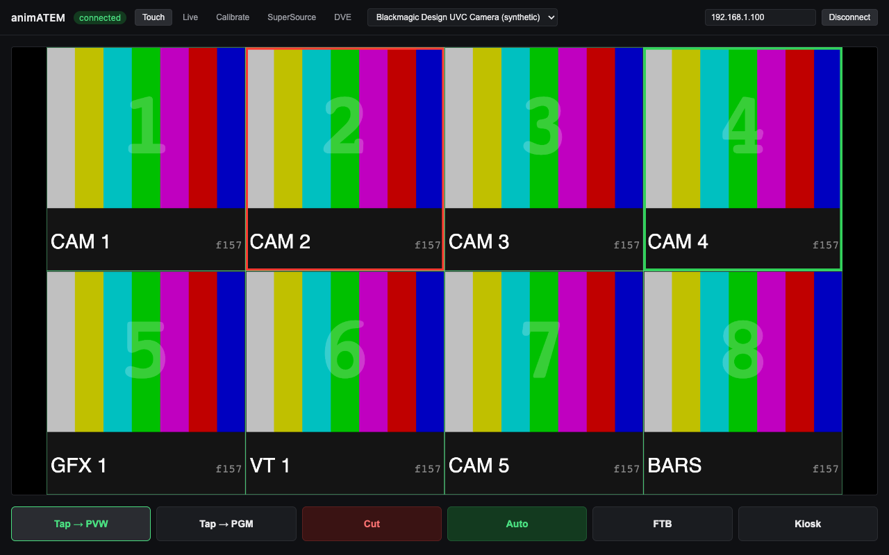
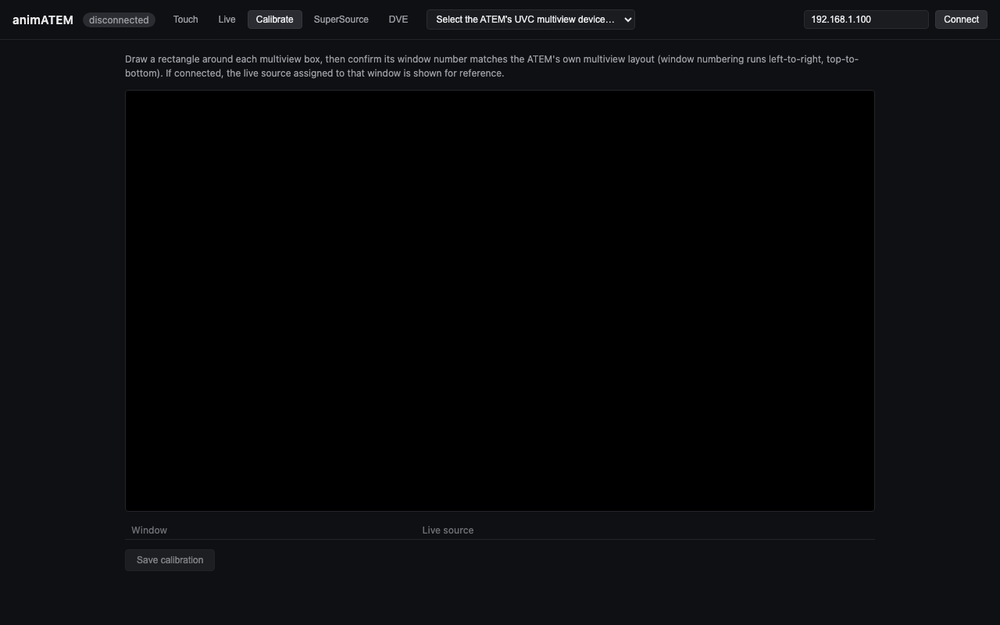
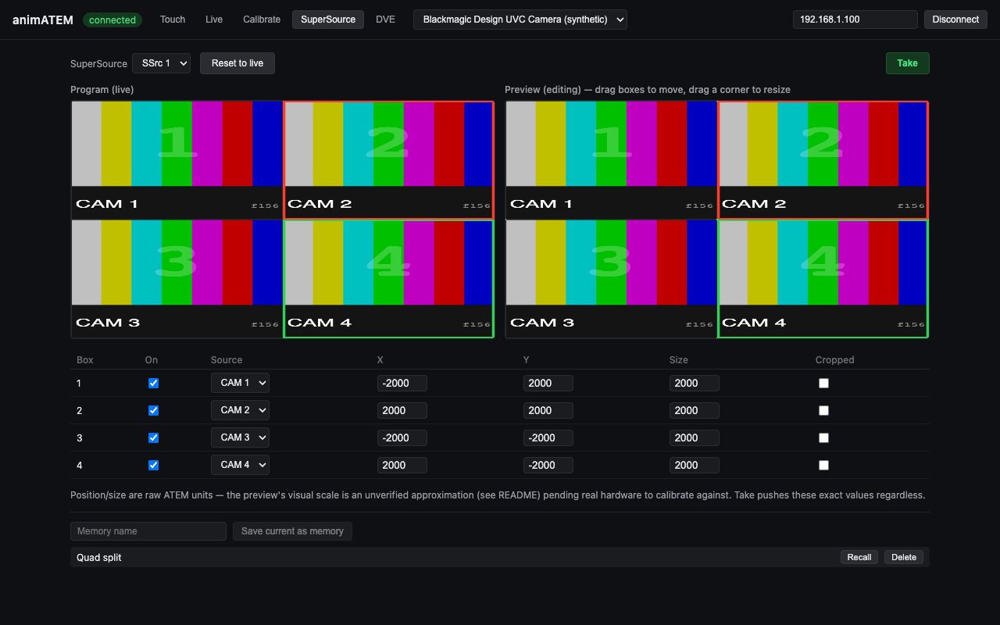
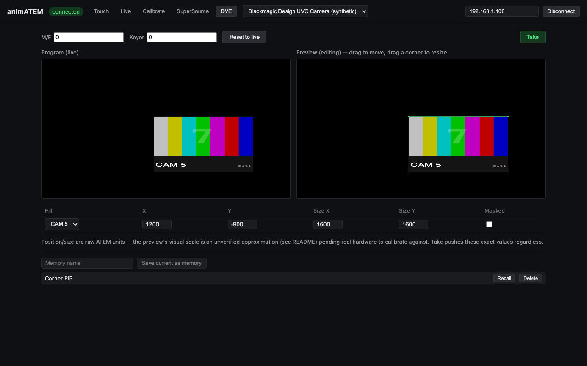
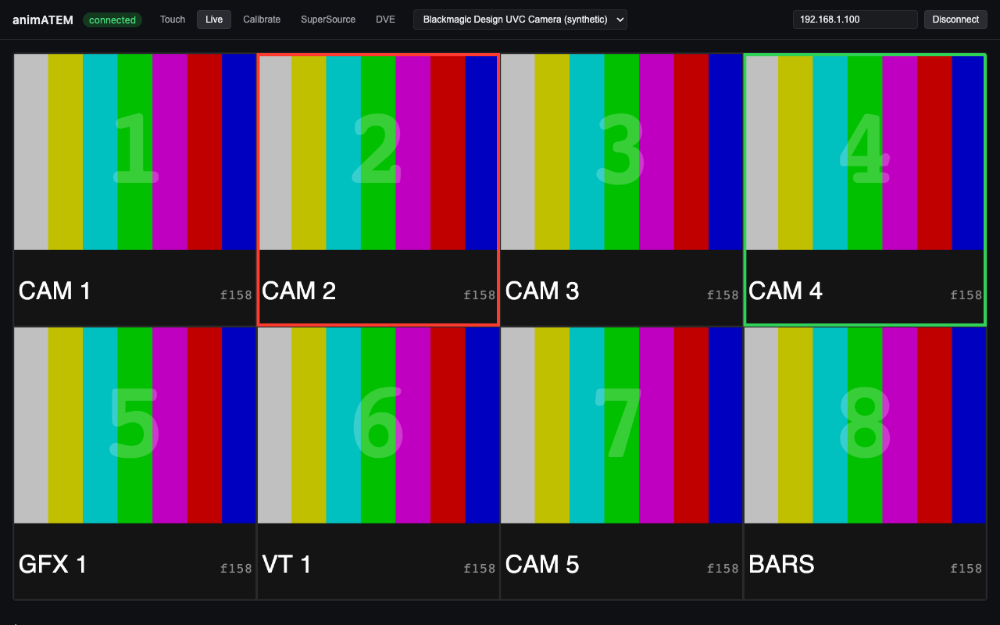

# animATEM

[](https://github.com/allansargeant/animATEM/actions/workflows/ci.yml)

> **AI-assisted project.** This codebase was created with [Claude Code](https://claude.com/claude-code)
> (Anthropic), directed and reviewed by a human author. It has not yet been
> validated against real ATEM hardware.

Network control for Blackmagic ATEM switchers (Mini Pro/Extreme ISO family,
Phase 1), with standard PGM/PVW switching plus a software-composited
preview/program workflow for SuperSource and DVE box layouts.

Instead of building a synthetic preview from scratch, animATEM captures the
switcher's own multiview output over USB (it enumerates as a UVC webcam),
crops the individual source boxes out of that live multiview feed in
software, and recomposites them into an arbitrary custom arrangement to
preview SuperSource/DVE changes with real live pixels before they're pushed
to air. Named "memories" — app-level presets, independent of the ATEM's own
macro system — capture and recall these arrangements.

A companion [Bitfocus Companion](https://bitfocus.io/companion) module lives
in [`companion-module/`](companion-module/README.md) — it lets Companion
buttons trigger Cut/Auto/FTB, source selection, and memory recall against
animATEM's local control server, with feedback/variables for the current
program/preview input.

## Concept


## Screenshots

The touchscreen operator view — a composited multiview with tap-to-select regions and a function key row below it:



The calibration screen, where an operator draws each multiview box's region once per capture resolution:



The SuperSource editor — Program (live) and Preview (editable, drag to move/resize) panes side by side, plus the memory bank:



The DVE editor, same Program/Preview/Take pattern applied to a single upstream keyer:



The raw multiview passthrough and live ATEM state, useful while wiring things up:



## Stack

Electron + `electron-vite` + React + TypeScript, following the same
conventions as this author's other Electron control apps
(`presentation-commander-client/server`, `MicWizard`):
`src/{main,preload,renderer,shared}`, service classes under
`src/main/services/*.ts`.

ATEM Ethernet protocol control via
[`atem-connection`](https://github.com/Sofie-Automation/sofie-atem-connection)
(main process — UDP). UVC multiview capture via the renderer's
`navigator.mediaDevices.getUserMedia` (full Chromium context, no native
addon needed).

## Development

```sh
npm install
npm run dev
```

`npm run typecheck` and `npm run lint` before committing.

**Known install gotcha on this machine (Node v26.5.0):** `electron`'s
postinstall uses `extract-zip@2.0.1`, whose promise hangs forever on this
Node version instead of extracting or erroring — `npm install` finishes
but `node_modules/electron/dist` is left with no `Electron.app`, and `npm
run dev` fails with `spawn .../Electron ENOENT`. If that happens:

```sh
# find the cached zip extract-zip already downloaded
find ~/Library/Caches/electron -iname "electron-v*.zip"

# extract it with the system unzip instead (fast, doesn't hang)
rm -rf node_modules/electron/dist
mkdir -p node_modules/electron/dist
unzip -q <path-to-the-zip-above> -d node_modules/electron/dist

# recreate the marker file install.js normally writes (no trailing newline!)
printf "Electron.app/Contents/MacOS/Electron" > node_modules/electron/path.txt
```

### Testing

```sh
npm run test
```

Unit tests cover the pure box-geometry/drag/coordinate-conversion math and
the file-backed calibration/memory stores (`vitest`, no hardware needed).
`companion-module/` has its own `npm run test` covering the control-server
WebSocket client. CI (`.github/workflows/ci.yml`) runs typecheck/lint/test
for both packages on every push and PR; `.github/workflows/release.yml`
builds installers for Windows/macOS/Linux (x64 + arm64) on a `v*` tag.

## Status

Phase 1 feature set is built: ATEM connection (standard switching — cut/
auto/FTB/program/preview/aux), UVC multiview capture, box calibration,
the SuperSource and DVE Program/Preview/Take workflow with drag-to-move/
resize editing, named memories, and the touchscreen operator UI with
kiosk mode. Everything has been exercised in isolated browser/Electron
harnesses (typecheck, lint, and functional checks all pass), but **none
of it has been run against a real ATEM switcher yet** — the coordinate
scale used for the Preview panes' visual layout (see `superSourceCoords.ts`
/ `dveCoords.ts`) is a labeled placeholder pending real hardware to
calibrate against, and the UVC capture path has only been exercised
against a generic webcam, not a real ATEM's multiview output.

Requires an ATEM Mini Pro/Extreme ISO with its USB output set to
**Multiview** (not the default Program) for the compositing workflow to
work.

The local control server (`ws://127.0.0.1:51234`) and the
[companion module](companion-module/README.md) that talks to it are also
built and verified end-to-end — a real WebSocket client (including the
module's own compiled client code) connects, receives the initial status/
snapshot/memories state, and round-trips commands against a running
animATEM instance without errors. Like everything else, actual command
behavior (cut/auto/recall) hasn't been checked against a real switcher yet.

Production packaging is verified too: `npm run build:mac` produces working
signed-nothing (no Apple dev cert yet) x64 + arm64 `.dmg`/`.zip` installers,
and the packaged arm64 `.app` boots cleanly on its own — full Electron
process tree comes up, the control server binds correctly — separate from
every other check in this project, which has run through `npm run dev`.

## ⚠️ Security note

The local control server (`src/main/services/controlServer.ts`) binds to
`127.0.0.1:51234` with **no authentication** — anything that can reach that
port on the local machine can cut/auto/FTB the switcher or recall a memory.
This is fine as long as it stays bound to localhost (the default, and the
only configuration this app currently supports). If you ever change that
binding to `0.0.0.0` or another network-reachable address, add
authentication first — as shipped, it is not safe to expose beyond
localhost.

## Unsigned builds — macOS Gatekeeper & Windows SmartScreen

The release builds are **not code-signed or notarized** — that needs paid Apple
/ Windows developer certificates this project doesn't carry. The app is safe to
run; the OS just can't verify a publisher, so it warns you the first time.
Here's how to get past that, and how to sign it yourself if you'd rather.

### macOS

Delivered as a `.dmg`/`.zip`. On first launch macOS says the app **"is damaged
and can't be opened"** or **"cannot be opened because the developer cannot be
verified"** — that's Gatekeeper reacting to the missing signature, not an actual
problem.

Easiest fix: **right-click (Control-click) the app in Applications → Open →
Open**. You only do this once. If it still says *"damaged"* (common when the
`.dmg` came through a browser), clear the quarantine flag in Terminal:

```sh
xattr -dr com.apple.quarantine "/Applications/animATEM.app"
```

### Windows

The installer is an unsigned `.exe`, so SmartScreen shows **"Windows protected
your PC"** → click **More info → Run anyway**. (Right-click → **Properties** →
**Unblock** also works.)

### Linux

`.AppImage`: `chmod +x` it and run. `.deb`: `sudo apt install ./<file>.deb`. No
signing gate.

### Signing it yourself (optional)

macOS ad-hoc (local only, not notarized):

```sh
codesign --force --deep --sign - "/Applications/animATEM.app"
```

To ship without warnings you need an **Apple Developer Program** membership
($99/yr) + a *Developer ID Application* certificate, then sign with the hardened
runtime and notarize:

```sh
codesign --force --deep --options runtime --timestamp \
  --sign "Developer ID Application: Your Name (TEAMID)" "animATEM.app"
ditto -c -k --keepParent "animATEM.app" "animATEM.zip"
xcrun notarytool submit "animATEM.zip" --apple-id you@example.com \
  --team-id TEAMID --password APP_SPECIFIC_PASSWORD --wait
xcrun stapler staple "animATEM.app"
```

electron-builder does all of this for you if you set `CSC_LINK`,
`CSC_KEY_PASSWORD`, `APPLE_ID`, `APPLE_APP_SPECIFIC_PASSWORD` and
`APPLE_TEAM_ID`. On Windows, clearing SmartScreen needs an Authenticode
code-signing certificate (`signtool sign`, or `CSC_LINK`/`CSC_KEY_PASSWORD` for
electron-builder).

## Roadmap / TODO

- [ ] **Validate against a real ATEM** — run the full compositing workflow and cut/auto/recall command behavior against a real Mini Pro/Extreme ISO (everything so far is verified only in browser/Electron harnesses).
- [ ] **Calibrate coordinate scale** — the SuperSource/DVE Preview layout scale (`superSourceCoords.ts` / `dveCoords.ts`) is a labeled placeholder pending real hardware to calibrate against.
- [ ] **Real multiview capture** — the UVC capture path has only been exercised against a generic webcam, not a real ATEM's multiview output.
